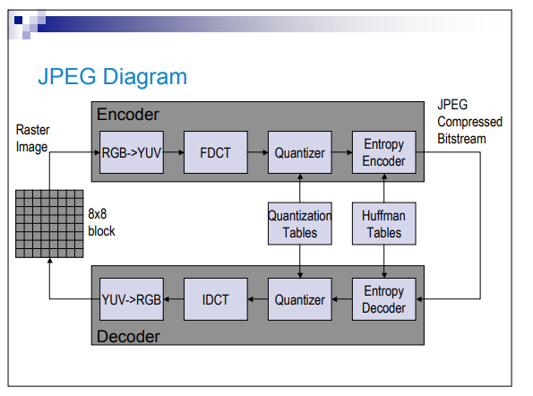

# JPEG COMPRESSION ALGORITHM

## Assignment Specification
  Implement the JPEG compression algorithm on a color image. Also implement the inverse function for decompression. Calculate the compression ratio for different images. 
  
  JPEG is a commonly used method of lossy compression for digital images, particularly for those images produced by digital photography. The degree of compression can be adjusted, allowing a selectable tradeoff between storage size and image quality. JPEG typically achieves 10:1 compression with little perceptible loss in image quality 
  
## Algorithm description

JPEG Compression algorithm has five main basic steps.

* Preprocessing for DCT transformation

* DCT Transformation

* Co-efficient Quantization

* Lossy Encoding

JPEG uses a lossy form of compression based on the discrete cosine transform (DCT). This mathematical operation converts each frame/field of the video source from the spatial (2D) domain into the frequency domain (a.k.a. transform domain). A perceptual model based loosely on the human psychovisual system discards high-frequency information, i.e. sharp transitions in intensity, and color hue. In the transform domain, the process of reducing information is called quantization. In simpler terms, quantization is a method for optimally reducing a large number scale (with different occurrences of each number) into a smaller one, and the transform-domain is a convenient representation of the image because the high-frequency coefficients, which contribute less to the overall picture than other coefficients, are characteristically small-values with high compressibility. The quantized coefficients are then sequenced and losslessly packed into the output bitstream. Nearly all software implementations of JPEG permit user control over the compression-ratio (as well as other optional parameters), allowing the user to trade off picture-quality for smaller file size. In embedded applications (such as miniDV, which uses a similar DCT-compression scheme), the parameters are pre-selected and fixed for the application.

## Performance(Experiments)
  ### (64/64) - 151 KB (155,520 bytes) / 154 KB (158,150 bytes)
    The compression with high def (64/64 most important items in block kept) took 124.452[ms] .
    Decompression took 175.419[ms].
    It is not noticable diference in image quality.
  
  ### (15/64) - 35.5 KB (36,450 bytes) / 154 KB (158,150 bytes)
    The compression with medium def (15/64 most important items in block kept) took 123.882 [ms] .
    Decompression took  175.623 [ms].
    It is barley noticable diference in image quality.
      
   ### (5/64) - 11.8 KB (12,150 bytes) / 154 KB (158,150 bytes)
    The compression with low def (5/64 most important items in block kept) took 120.365 [ms] .
    Decompression took  172.724 [ms].
    It is mostly noticable diference in image quality.
  
## Bibliography

[https://en.wikipedia.org/wiki/JPEG] 
[http://www0.cs.ucl.ac.uk/teaching/GZ05/07-images.pdf] 
[http://users.utcluj.ro/~rdanescu/teaching_pi.html] 
